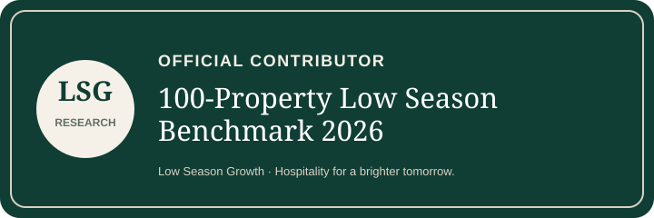

# 100-Property Low Season Benchmark 2026 — Contributor Badge

This badge is reserved for properties and hospitality professionals whose usable contribution has been accepted into the Low Season Growth benchmark dataset.

**Do not use the badge merely because you were invited.**

## Badge



## Suggested embed

```html
<a href="https://lowseasongrowth.com/blogs/news/100-property-low-season-benchmark-2026"
   rel="noopener"
   title="100-Property Low Season Benchmark 2026">
  
</a>
```

The link is optional. Contributors may also download and display the badge without linking.

## Attribution rule

Low Season Growth will only list a property or professional publicly when they have explicitly chosen credited attribution. Anonymous contributors may receive the badge privately but will not be named publicly.

Official benchmark:
https://lowseasongrowth.com/blogs/news/100-property-low-season-benchmark-2026
